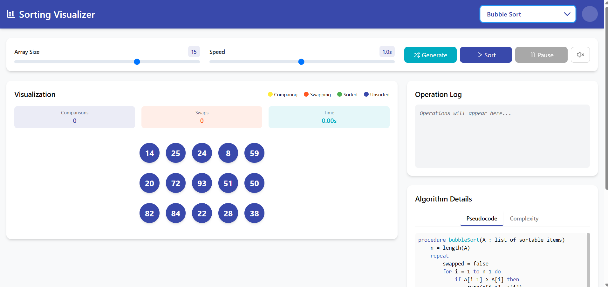
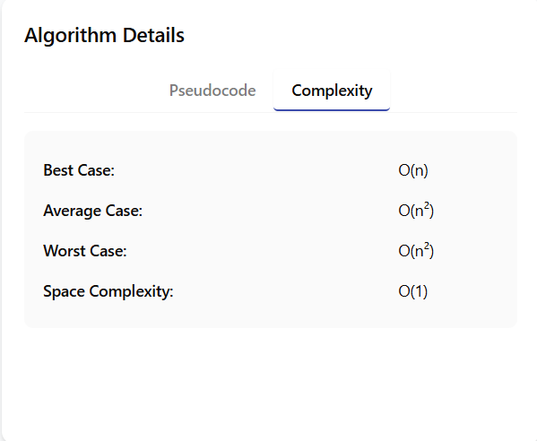
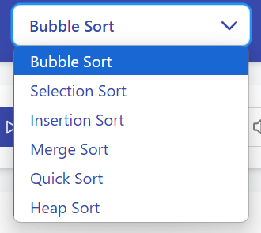
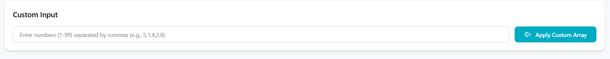

# Sorting Algorithm Visualizer

An interactive and educational sorting algorithm visualizer built with React, TypeScript, and Express.js. This application helps users understand complex sorting techniques through dynamic animations and step-by-step visualization.



## Features

- **Multiple Sorting Algorithms**: Bubble Sort, Selection Sort, Insertion Sort, Merge Sort, Quick Sort, and Heap Sort
- **Real-time Visualization**: Watch algorithms sort arrays with animated circular elements
- **Interactive Controls**: Adjust array size, sorting speed, and enable/disable sound effects
- **Custom Array Input**: Enter your own numbers to see how algorithms handle specific data
- **Algorithm Information**: View pseudocode and time/space complexity for each algorithm
- **Operation Logging**: Track comparisons and swaps in real-time
- **Responsive Design**: Works on desktop, tablet, and mobile devices
- **Sound Effects**: Audio feedback for comparisons and swaps (optional)

## Screenshots

### Main Interface

*The main sorting visualizer interface showing circular elements and controls*

### Algorithm Details


*Algorithm information panel with pseudocode and complexity analysis*

### Custom Array Input

*Custom array input feature for testing specific scenarios*

## Tech Stack

- **Frontend**: React 18, TypeScript, Vite
- **Backend**: Express.js, Node.js
- **Styling**: Tailwind CSS, Radix UI components
- **Audio**: Tone.js for sound effects
- **State Management**: React Query, Custom hooks
- **Build Tool**: Vite
- **Package Manager**: npm

## Project Structure

```
sorting-visualizer/
├── client/                          # Frontend React application
│   ├── src/
│   │   ├── components/
│   │   │   ├── ui/                  # Reusable UI components (Radix UI)
│   │   │   │   ├── button.tsx
│   │   │   │   ├── input.tsx
│   │   │   │   ├── slider.tsx
│   │   │   │   ├── switch.tsx
│   │   │   │   ├── tabs.tsx
│   │   │   │   └── ...
│   │   │   ├── AlgorithmInfo.tsx    # Algorithm details and pseudocode
│   │   │   ├── CustomArrayInput.tsx # Custom array input component
│   │   │   ├── InfoModal.tsx        # Information modal
│   │   │   ├── SortingVisualizer.tsx # Main visualizer component
│   │   │   ├── VisualizerControls.tsx # Control panel
│   │   │   └── VisualizerDisplay.tsx # Array visualization
│   │   ├── hooks/
│   │   │   ├── use-mobile.tsx       # Mobile detection hook
│   │   │   ├── use-toast.ts         # Toast notifications
│   │   │   └── useSorting.tsx       # Main sorting logic hook
│   │   ├── lib/
│   │   │   ├── algorithms.ts        # Sorting algorithm implementations
│   │   │   ├── audio.ts             # Sound effect utilities
│   │   │   ├── queryClient.ts       # React Query configuration
│   │   │   └── utils.ts             # Utility functions
│   │   ├── pages/
│   │   │   ├── home.tsx             # Home page component
│   │   │   └── not-found.tsx        # 404 page component
│   │   ├── App.tsx                  # Main app component with routing
│   │   ├── index.css                # Global styles and CSS variables
│   │   └── main.tsx                 # App entry point
│   └── index.html                   # HTML template
├── server/                          # Backend Express server
│   ├── index.ts                     # Server entry point
│   ├── routes.ts                    # API routes
│   ├── storage.ts                   # In-memory storage implementation
│   └── vite.ts                      # Vite development server setup
├── shared/                          # Shared types and schemas
│   └── schema.ts                    # Data models and validation
├── screenshots/                     # Project screenshots (add your images here)
│   ├── main-interface.png
│   ├── algorithm-details.png
│   └── custom-input.png
├── components.json                  # Shadcn UI configuration
├── drizzle.config.ts               # Database configuration
├── package.json                     # Dependencies and scripts
├── postcss.config.js               # PostCSS configuration
├── tailwind.config.ts              # Tailwind CSS configuration
├── tsconfig.json                   # TypeScript configuration
├── vite.config.ts                  # Vite configuration
└── README.md                       # Project documentation
```

## Prerequisites

Before running this project, make sure you have the following installed:

- **Node.js** (version 18 or higher) - [Download here](https://nodejs.org/)
- **npm** (comes with Node.js)
- **Git** (optional, for cloning)

## Installation & Setup

### 1. Clone the Repository
```bash
git clone https://github.com/Ramaskandan-sk/sorting-visualizer.git
cd sorting-visualizer
```

### 2. Install Dependencies
```bash
npm install
```

### 3. Start Development Server
```bash
npm run dev
```

The application will be available at `http://localhost:5000`

## Available Scripts

- `npm run dev` - Start development server with hot reload
- `npm run build` - Build the project for production
- `npm run preview` - Preview the production build locally
- `npm run check` - Run TypeScript type checking

## How to Use

### Basic Usage
1. **Select Algorithm**: Choose from 6 different sorting algorithms using the dropdown
2. **Adjust Settings**: 
   - Set array size (2-20 elements)
   - Control animation speed (0.1-2 seconds)
   - Enable/disable sound effects
3. **Generate Array**: Click "Generate" to create a new random array
4. **Start Sorting**: Click "Start" to begin the visualization
5. **Control Playback**: Use pause/resume and reset controls

### Custom Array Input
1. Scroll down to the "Custom Input" section
2. Enter numbers separated by commas (e.g., `5,1,4,2,8`)
3. Click "Apply Custom Array"
4. Select an algorithm and start sorting

### Algorithm Information
- Switch between "Pseudocode" and "Complexity" tabs
- View detailed implementation steps
- Learn about time and space complexity

## Supported Algorithms

| Algorithm | Best Case | Average Case | Worst Case | Space Complexity |
|-----------|-----------|--------------|------------|-----------------|
| Bubble Sort | O(n) | O(n²) | O(n²) | O(1) |
| Selection Sort | O(n²) | O(n²) | O(n²) | O(1) |
| Insertion Sort | O(n) | O(n²) | O(n²) | O(1) |
| Merge Sort | O(n log n) | O(n log n) | O(n log n) | O(n) |
| Quick Sort | O(n log n) | O(n log n) | O(n²) | O(log n) |
| Heap Sort | O(n log n) | O(n log n) | O(n log n) | O(1) |

## Features in Detail

### Visual Elements
- **Circular Elements**: Numbers are displayed in colored circles
- **Color Coding**: 
  - Blue: Elements being compared
  - Orange: Elements being swapped
  - Green: Sorted elements
- **Animation**: Smooth transitions between states

### Audio Features
- **Comparison Sound**: High-pitched tone when comparing elements
- **Swap Sound**: Lower-pitched tone when swapping elements
- **Toggle**: Enable/disable sound effects

### Operation Log
- Real-time display of algorithm operations
- Color-coded entries for easy reading
- Shows element values during swaps
- Displays final sorted array

## Development

### Local Development Setup

1. **VS Code Setup** (Recommended):
   - Install recommended extensions:
     - TypeScript and JavaScript Language Features
     - ES7+ React/Redux/React-Native snippets
     - Tailwind CSS IntelliSense
     - Auto Rename Tag
     - Prettier - Code formatter

2. **Environment Configuration**:
   ```bash
   # No environment variables required for basic functionality
   # Optional: Add sound settings or API configurations
   ```

3. **File Structure Guidelines**:
   - Components use TypeScript and functional components
   - Styles use Tailwind CSS classes
   - State management through custom hooks
   - Type safety with Zod schemas

### Adding New Algorithms

To add a new sorting algorithm:

1. **Update Algorithm Type**:
   ```typescript
   // In lib/algorithms.ts
   export type Algorithm = "bubble" | "selection" | "insertion" | "merge" | "quick" | "heap" | "newAlgorithm";
   ```

2. **Implement Algorithm**:
   ```typescript
   export function newAlgorithmSort(array: number[], animations: Animation[]): void {
     // Implementation here
   }
   ```

3. **Add to Switch Statement**:
   ```typescript
   // In useSorting.tsx
   case "newAlgorithm":
     newAlgorithmSort(arrayCopy, animations);
     break;
   ```

4. **Update UI**:
   ```tsx
   {/* In SortingVisualizer.tsx */}
   <option value="newAlgorithm">New Algorithm</option>
   ```

## Contributing

1. Fork the repository
2. Create a feature branch (`git checkout -b feature/amazing-feature`)
3. Commit your changes (`git commit -m 'Add some amazing feature'`)
4. Push to the branch (`git push origin feature/amazing-feature`)
5. Open a Pull Request

## License

This project is licensed under the MIT License - see the [LICENSE](LICENSE) file for details.

## Acknowledgments

- Built with [React](https://reactjs.org/)
- UI components from [Radix UI](https://www.radix-ui.com/)
- Styling with [Tailwind CSS](https://tailwindcss.com/)
- Audio powered by [Tone.js](https://tonejs.github.io/)
- Icons from [Lucide React](https://lucide.dev/)

## Contact

Ramaskandan-sk - ramaskandansk@gmail.com

Project Link: [https://github.com/Ramaskandan-sk/sorting-visualizer](https://github.com/Ramaskandan-sk/sorting-visualizer)

---

Made with ❤️ for educational purposes